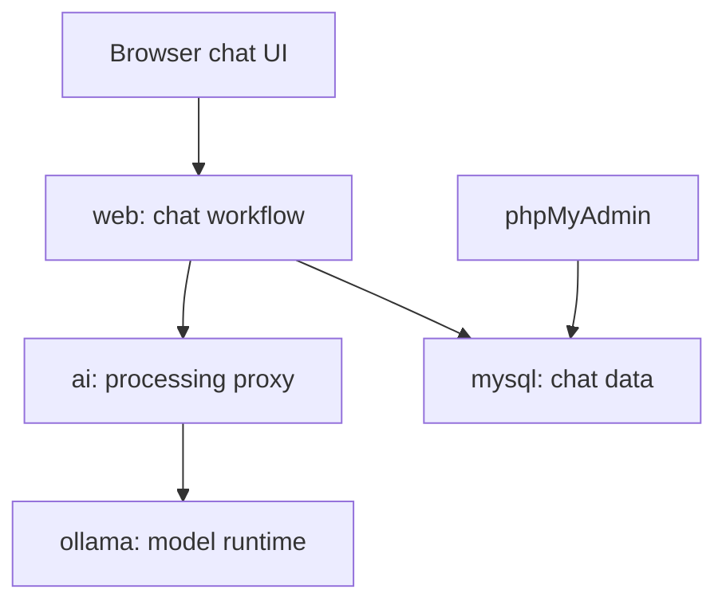

# L3M: Local Large Language Model PRoject Template

L3M is a Docker-based quickstart for building local AI tools.

It starts as a working chat application, this is a minimum viable product implemented as an example. The real purpose of the repository is to give you a reusable foundation with clear places to add guardrails, prompt processing, model routing, queues, agents, retrieval, background jobs, or a completely different user experience.

The project is **production-shaped**, so configuration, lifecycle management, persistence, tests, and service boundaries are present from the beginning. It is still a **development template**, not a production-ready product. The extra structure may look unfamiliar if this is your first multi-container application; this guide explains what each part is doing and why it exists.

## What you get

- A browser-based chat interface with streamed responses and image file uploads.
- Browser includes model selection and user feedback of errors.
- Persistent chats and messages in MySQL.
- Persistent users, created automatically by name.
- Image attachments stored in a Docker volume.
- Ollama for running models locally.
- A transparent AI processing layer between the web app and Ollama
- phpMyAdmin for inspecting the development database
- Environment-file update scripts for Windows and Bash
- Container health checks, graceful startup and shutdown, and automatic restarts
- Reproducible Python dependencies with `uv` and checked-in lockfiles
- Backend tests in disposable Docker build stages, plus browser JavaScript tests

## The five services

| Service | Responsibility | Default host access |
| --- | --- | --- |
| `web` | FastAPI application, browser UI, chat workflow, uploads, and persistence | <http://localhost:8000> |
| `ai` | Ollama-compatible processing proxy and extension point | Internal only at `http://ai:8020` |
| `ollama` | Loads local models and generates responses | <http://127.0.0.1:11434> |
| `mysql` | Stores users, chats, messages, and attachment metadata | `127.0.0.1:3306` |
| `phpmyadmin` | Development UI for inspecting MySQL | <http://localhost:8080> |

These names matter. Containers communicate using Compose service names such as `mysql`, `ai`, and `ollama`. Inside a container, `localhost` means that same container—not your computer and not another service.

## How a chat request moves through the stack



For a normal user message:

1. The browser sends the message to `POST /api/chats/{chat_id}/messages` on the web service.
2. The web service loads the chat history, prepares any attachments, and builds an Ollama-compatible `POST /api/chat` request.
3. The request goes to `http://ai:8020`, not directly to Ollama.
4. The AI service recognizes a valid chat body and passes through the current no-op processing extension point.
5. The AI service forwards the request to `http://ollama:11434/api/chat` and streams Ollama's response back unchanged.
6. The web service streams response events to the browser and saves the completed exchange in MySQL.

The AI service also forwards other Ollama routes. For example, a request made inside the Compose network to:

```text
http://ai:8020/api/generate
```

is forwarded to:

```text
http://ollama:11434/api/generate
```

Even `POST /api/chat` bodies that do not match the structure currently understood by the AI service are forwarded unchanged. Validation decides whether custom processing can safely run; it does not replace Ollama's own validation. This preserves Ollama's API contract while leaving a clean interception point for future work.

## Requirements

- Docker Engine with the Docker Compose plugin
- Enough disk space for the models you plan to use
- Optional: `make` for the shorter helper commands
- Optional: an NVIDIA GPU and a working NVIDIA Container Toolkit installation

The repository was originally developed on Windows 11 with WSL, but the Docker workflow is intended to be portable.

> [!IMPORTANT]
> The supplied Compose file requests an NVIDIA GPU for Ollama. If the machine does not have a compatible NVIDIA setup, comment out the marked GPU `deploy` block in `compose.yaml` before starting the stack. Ollama can then run on the CPU, although generation will usually be slower.

## Quickstart

### 1. Create your environment file

Run the updater from the repository root. It creates `.env` from `sample.env` when `.env` does not exist.

Windows Command Prompt or PowerShell:

```powershell
.\update_env.bat
```

Linux, macOS, or WSL:

```bash
chmod +x ./update_env.sh
./update_env.sh
```

You can also create it without the updater:

```bash
cp sample.env .env
```

Open `.env` and replace the example MySQL passwords. You can also choose a different default model:

```dotenv
OLLAMA_MODEL=gemma3:4b
MYSQL_PASSWORD=choose-a-development-password
MYSQL_ROOT_PASSWORD=choose-a-different-root-password
```

Do not commit `.env`. It is ignored by Git because it can contain machine-specific values and secrets.

<style>span{color:Blue;}</style>

If you run the updater in the future it will sync any new values from <span>sample.env</span> while preserving the contents of .env

### 2. Start the stack

```bash
docker compose up --build --detach
docker compose ps
```

Wait until the services report `healthy`. To follow startup logs:

```bash
docker compose logs --follow web ai ollama mysql
```

Press `Ctrl+C` to stop following logs; the containers keep running.

### 3. Download the configured model

Ollama starts without downloading a model automatically. Pull the model selected by `OLLAMA_MODEL`:

```bash
docker compose exec ollama sh -c 'ollama pull "$OLLAMA_MODEL"'
```

The web service takes a snapshot of installed models when it starts. Restart it after adding or removing models:

```bash
docker compose restart web
```

### 4. Open the application

- Chat UI: <http://localhost:8000>
- API documentation: <http://localhost:8000/docs>
- phpMyAdmin: <http://localhost:8080>

If the page loads but a response cannot be generated, start with:

```bash
docker compose ps
docker compose logs --tail=100 web ai ollama
```

## Your first customization: where should new logic go?

There are two intentional places to extend the chat path. Choose the boundary based on what the logic needs to know.

| Add the logic in… | Use it when the feature… | Starting file |
| --- | --- | --- |
| The `ai` service | Should apply to every compatible AI request, regardless of which UI or client sent it | `ai/src/l3m_ai/routes.py` |
| The `web` service | Depends on users, chat history, uploads, database records, or browser-facing events | `web/src/L3M_Web/api/routes/chat.py` |

### Option A: the AI processing layer

Start in:

```text
ai/src/l3m_ai/routes.py
```

The `POST /api/chat` route validates the part of the Ollama chat contract that the template understands. Immediately after validation is a comment block labelled:

```text
AI PROCESSING EXTENSION POINT
```

That block is the intended starting point for cross-cutting AI behavior, including:

- input or output guardrails
- prompt or system-message injection
- model selection and fallback rules
- queues, rate limits, and concurrency controls
- routing between several Ollama servers or external API providers
- logging, tracing, cost accounting, or audit hooks

The template currently leaves the request body untouched. When you begin processing it, keep the Ollama contract in mind: callers should still receive the status codes, streaming format, and response fields they expect unless you deliberately document a new contract.

The nearby AI files have narrower responsibilities:

| File | Purpose |
| --- | --- |
| `ai/src/l3m_ai/main.py` | Small process entry point; normally does not contain feature logic |
| `ai/src/l3m_ai/app_factory.py` | Creates the FastAPI app and the shared Ollama HTTP client |
| `ai/src/l3m_ai/routes.py` | Recognizes chat requests and exposes the processing extension point |
| `ai/src/l3m_ai/proxy.py` | Low-level transparent forwarding, headers, streaming, and one-line request summaries |
| `ai/src/l3m_ai/settings.py` | Environment-backed AI configuration |

Change `proxy.py` when you need to change transport behavior. Put AI product rules in `routes.py` or in a new service module called from it.

### Option B: the web chat workflow

Start in:

```text
web/src/L3M_Web/api/routes/chat.py
```

The `add_message` endpoint coordinates the current product workflow: it validates the browser form, loads history, prepares attachments, selects a model, requests generation, streams browser events, and saves the exchange.

This is the better boundary for features such as:

- per-user permissions or usage limits
- chat-specific context and memory
- retrieval based on stored application data
- attachment rules and preprocessing
- deciding what gets saved in MySQL
- changing the events streamed to the browser

The Ollama request itself is constructed and consumed in:

```text
web/src/L3M_Web/api/services/ollama_chat.py
```

A useful rule of thumb is: **web logic understands the application; AI logic understands model traffic**. Avoid implementing the same policy in both places unless the duplication is intentional.

## Repository map

You do not need to understand every file before making a change. This is the practical map:

```text
.
├── compose.yaml                 # Defines and connects all five services
├── sample.env                  # Documented environment-variable template
├── update_env.bat              # Windows environment-file updater
├── update_env.sh               # Bash environment-file updater
├── Makefile                    # Shortcuts for common Docker tasks
├── ai/
│   ├── Dockerfile
│   ├── pyproject.toml
│   ├── uv.lock
│   ├── src/l3m_ai/             # AI proxy and future processing logic
│   └── tests/
└── web/
    ├── Dockerfile
    ├── pyproject.toml
    ├── uv.lock
    ├── src/L3M_Web/
    │   ├── main.py             # Minimal importable entry point
    │   ├── app_factory.py      # Creates and wires the web application
    │   ├── lifespan.py         # Starts and closes shared resources
    │   ├── api/                # HTTP models, routes, dependencies, services
    │   ├── config/             # Settings, validation, and logging
    │   ├── database/           # SQLAlchemy models and repositories
    │   ├── domain/             # Application concepts independent of HTTP
    │   ├── infrastructure/     # MySQL and Ollama client setup
    │   ├── static/             # Browser CSS, JavaScript, and images
    │   └── templates/          # Jinja HTML templates
    └── tests/
```

When exploring the web service for the first time, a helpful reading order is:

1. `main.py`
2. `app_factory.py`
3. `api/routes/chat.py`
4. `api/services/ollama_chat.py`
5. `database/chat_repository.py`
6. `lifespan.py` and `infrastructure/`

## Repository automation

### Keeping `.env` files in sync

`update_env.bat` and `update_env.sh` use files named `sample.env*` as templates:

```text
sample.env        -> .env
sample.env.local  -> .env.local
sample.env.test   -> .env.test
```

For each matching file, the updater:

- creates the target file if it is missing
- adds variables newly introduced by the sample
- preserves existing non-empty target values
- rebuilds the file in the sample's order, with the sample's comments
- keeps target-only variables in a clearly labelled section at the end
- reports variables that were added or retained as extras

This makes pulling template changes easier: add a new setting to `sample.env`, run the updater, and the setting appears in each developer's `.env` without replacing their existing passwords or machine-specific paths.

> [!WARNING]
> The updater rewrites target environment files directly and is intentionally interactive. Treat it as a development convenience, review its output, and do not use it as a production secret-management system.

Whenever code starts depending on a new environment variable:

1. Add a documented default or placeholder to the appropriate `sample.env*` file.
2. Add it to the relevant Pydantic settings class.
3. Pass it through `compose.yaml` if Compose needs to supply or interpolate it.
4. Run the environment updater and `docker compose config --quiet`.

### Make shortcuts

If `make` is available, run `make help` to see the bundled commands:

| Command | What it does |
| --- | --- |
| `make init` | Copies `sample.env` to `.env` only when `.env` is missing |
| `make up` | Builds and starts the stack |
| `make down` | Stops the stack and preserves data |
| `make logs` | Follows logs from all services |
| `make ps` | Shows container and health status |
| `make pull-model` | Pulls the configured `OLLAMA_MODEL` |
| `make check` | Validates the rendered Compose configuration |
| `make reset` | Deletes containers and named volumes; destructive |

`make init` is deliberately simpler than the update scripts. Use the scripts when an existing `.env` needs to be synchronized with new template variables.

## Why the project is structured this way

The structure adds a little ceremony now to make future changes safer and easier to locate.

### Separate `web`, `ai`, and `ollama` services

The web application can focus on product concerns while the AI layer focuses on model traffic. Ollama remains replaceable infrastructure. Later, the AI service can route to multiple local servers or remote providers without requiring the browser or most of the web application to know how that decision is made.

### Small entry points and application factories

`main.py` stays small, while `app_factory.py` builds the application. This makes startup easy to understand and lets tests construct an app with controlled settings or fake dependencies.

### Lifespan-managed resources

Database engines and HTTP clients are created once during application startup and closed cleanly during shutdown. Reusing them is more efficient than opening a new connection for every request, and explicit cleanup prevents resource leaks.

### Routes, services, repositories, and infrastructure

- **Routes** translate HTTP requests and responses.
- **Services** implement reusable workflows or integrations.
- **Repositories** isolate database reads and writes.
- **Infrastructure** creates clients and connections to external systems.
- **Domain modules** describe application concepts without depending on HTTP.

This separation is not a rule that every feature needs a new file. Start in the existing route, then extract a service when the logic becomes reusable, complex, or difficult to test in place.

### Environment-backed settings

Images stay portable because hostnames, ports, credentials, model choices, limits, and storage paths come from environment variables. The same images can be configured differently without editing source code.

### Health checks and startup dependencies

Compose checks whether services are ready, not merely whether their processes exist. The web service waits for MySQL and the AI service; the AI service waits for Ollama. This reduces timing-related startup failures and makes `docker compose ps` useful when diagnosing the stack.

### Multi-stage images and locked dependencies

Each Python image has separate build, test, and runtime stages. Tests and development dependencies do not need to remain in the final runtime image. `uv.lock` makes dependency resolution repeatable across machines and builds.

### Non-root runtime users

The Python services run as an application user rather than as root. This is a useful container security baseline and catches file-permission assumptions earlier.

## Configuration guide

The main groups in `sample.env` are:

| Group | Examples | Why you might change it |
| --- | --- | --- |
| Application | `ENVIRONMENT_TYPE`, `LOG_LEVEL`, `COMPOSE_PROJECT_NAME` | Naming and diagnostic output |
| Model | `OLLAMA_MODEL`, `OLLAMA_MODEL_STORAGE` | Default model and persistent model location |
| Ports | `WEB_PORT`, `AI_PORT`, `MYSQL_PORT`, `OLLAMA_PORT` | Avoid collisions or control host access |
| Database | `MYSQL_DATABASE`, `MYSQL_USER`, passwords | Local database identity and credentials |
| Uploads | `MAX_UPLOAD_FILES`, byte limits | Attachment policy and resource limits |

The sample model storage path is inside the repository:

```dotenv
OLLAMA_MODEL_STORAGE="./.ollama_data"
```

Point it at a stable external directory if several projects should share downloaded models. Model files can be large, so confirm the resolved path before moving or deleting the repository.

`AI_PORT` is an internal service port by default. Compose exposes it to other containers but does not publish it to the host. The web service reaches it through `http://ai:8020`.

## Useful endpoints

| Endpoint | Purpose |
| --- | --- |
| `GET http://localhost:8000/` | Chat application |
| `GET http://localhost:8000/healthz` | Web process liveness |
| `GET http://localhost:8000/readyz` | Web dependency readiness |
| `GET http://localhost:8000/docs` | Interactive web API documentation |
| `GET http://ai:8020/healthz` | AI proxy liveness from inside the Compose network |
| `http://localhost:8080` | phpMyAdmin development interface |

The AI proxy intentionally does not expose OpenAPI documentation because its catch-all contract is Ollama's API rather than a second, separately maintained API definition.

## Development workflow

After changing Python dependencies, update the relevant `pyproject.toml` and lockfile. Build the service again so the image contains the new environment.

Run the test stages:

```bash
docker build --target test web
docker build --target test ai
```

Run the dependency-free browser JavaScript tests with Node.js 20 or newer:

```bash
cd web/src/L3M_Web
npm run test:frontend
```

Validate Compose and inspect the resolved configuration:

```bash
docker compose config --quiet
docker compose config
```

Rebuild one service while working on it:

```bash
docker compose up --build --detach ai
docker compose logs --follow ai
```

Use the equivalent command with `web` when changing the web application.

## Data and cleanup

The stack persists different data in different places:

| Data | Storage | Removed by `docker compose down --volumes`? |
| --- | --- | --- |
| MySQL database | `mysql-data` named volume | Yes |
| Chat attachments | `chat-uploads` named volume | Yes |
| Ollama models | Bind-mounted `OLLAMA_MODEL_STORAGE` path | No |

Stop containers while preserving data:

```bash
docker compose down
```

Delete containers and the named MySQL/upload volumes:

```bash
docker compose down --volumes
```

The second command is destructive, but it still does not delete a bind-mounted model directory such as `./.ollama_data`. Remove that directory separately only when you are certain the models are no longer needed.

## Troubleshooting

### A configured model is not shown in the web UI

Pull it, then restart the web service so it refreshes its installed-model snapshot:

```bash
docker compose exec ollama sh -c 'ollama pull "$OLLAMA_MODEL"'
docker compose restart web
```

### The AI service reports that Ollama is unavailable

Check both services and test Ollama inside its own container:

```bash
docker compose ps
docker compose logs --tail=100 ai ollama
docker compose exec ollama ollama list
```

If `ollama run MODEL "Reply with OK"` fails inside the Ollama container, the failure is in the model/runtime path rather than the web or AI proxy.

### A service cannot reach another service

Use the Compose service name and the container port. For example:

- web to AI: `http://ai:8020`
- AI to Ollama: `http://ollama:11434`
- web to MySQL: host `mysql`, port `3306`

Host-published addresses such as `127.0.0.1:11434` are for programs running on the host, not for container-to-container traffic.

### The stack fails on a machine without an NVIDIA GPU

Comment out the GPU reservation block marked in `compose.yaml`, then run:

```bash
docker compose up --build --detach
```

### A port is already in use

Change the matching host-facing value in `.env`, such as `WEB_PORT` or `PHPMYADMIN_PORT`, then recreate the affected service. Do not change internal service URLs unless you also change the service's listening port.

## Before using this in production

This repository uses several production-friendly patterns, but it is not production hardened. A real deployment will normally need decisions and implementation for:

- authentication and authorization
- HTTPS and a reverse proxy
- managed secrets rather than plain `.env` files
- explicit database migrations and backups
- rate limiting, abuse controls, and request-size limits
- guardrails appropriate to the application and models
- observability, audit policy, and sensitive-data handling
- restricted or removed phpMyAdmin and database host ports
- model licensing, capacity planning, and failure recovery
- tested upgrade and rollback procedures

Treat the template as the point where product development begins, not the point where a public deployment is finished.

## Suggested next steps

1. Run the quickstart unchanged and send one successful message.
2. Read the request flow and choose either the AI or web extension point.
3. Add one small rule—for example, prepend a system message or reject an unsupported attachment.
4. Add a focused test for that rule.
5. Add any new configuration to `sample.env` and run the environment updater.
6. Rebuild only the service you changed and confirm its health and logs.

That workflow keeps the first change small while preserving the service boundaries that make the template useful as the project grows.
